# Actividad 3 – Machine Learning II  
## Predicción de Churn con Naïve Bayes y Support Vector Machines

Este repositorio contiene el desarrollo completo de la **Actividad 3 del curso Machine Learning II**, centrada en la resolución de un problema de **clasificación binaria desbalanceada**: la predicción de **abandono de clientes (churn)** en una empresa de telecomunicaciones.

El trabajo aborda el problema desde una perspectiva práctica y metodológica, incorporando preprocesamiento robusto, optimización de hiperparámetros, evaluación con métricas adecuadas para desbalance de clases y análisis crítico de resultados.

---

## 🎯 Objetivo

Implementar, optimizar y comparar distintos modelos de clasificación supervisada para predecir churn, evaluando su desempeño mediante métricas relevantes para la clase minoritaria.

Los modelos considerados son:

- **Naïve Bayes (GaussianNB)**
- **Support Vector Machine (SVM) Lineal (calibrado)**
- **Support Vector Machine (SVM) con kernel RBF**
- **SVM RBF con ajuste por desbalance de clases (`class_weight = "balanced"`)**

---

## 📊 Dataset

- **Nombre:** Telco Churn  
- **Archivo:** `data/data-churn.csv`  
- **Variable objetivo:** `Churn` (Yes / No → 1 / 0)

El dataset contiene información demográfica, contractual y de facturación de clientes, con variables numéricas y categóricas.

---

## 🧪 Metodología

El desarrollo sigue las siguientes etapas:

1. **Carga y limpieza de datos**
   - Conversión de `TotalCharges` a formato numérico
   - Manejo de valores faltantes
   - Eliminación de identificadores no informativos (`customerID`)

2. **Análisis exploratorio**
   - Revisión de la distribución de la variable objetivo
   - Análisis de correlación entre variables numéricas

3. **Preprocesamiento**
   - Separación de variables numéricas y categóricas
   - Pipelines con imputación, escalamiento y one-hot encoding
   - Uso de `ColumnTransformer`

4. **División del dataset**
   - Split 80/20 con estratificación
   - Preservación del desbalance de clases

5. **Entrenamiento y optimización**
   - GridSearchCV y RandomizedSearchCV
   - Validación cruzada estratificada
   - Métrica principal: **F1-score (clase churn)**

6. **Evaluación**
   - Accuracy, Precision, Recall, F1-score
   - ROC-AUC y Precision–Recall AUC
   - Matrices de confusión y curvas ROC / PR

7. **Comparación y conclusiones**
   - Análisis de trade-offs entre modelos
   - Impacto del desbalance y del costo computacional

---

## 📈 Resultados visuales

Las principales visualizaciones generadas durante la evaluación se encuentran en la carpeta `figures/`.

### Naïve Bayes
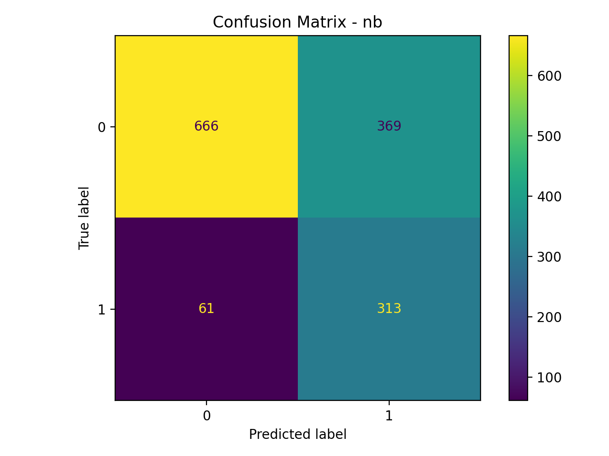  
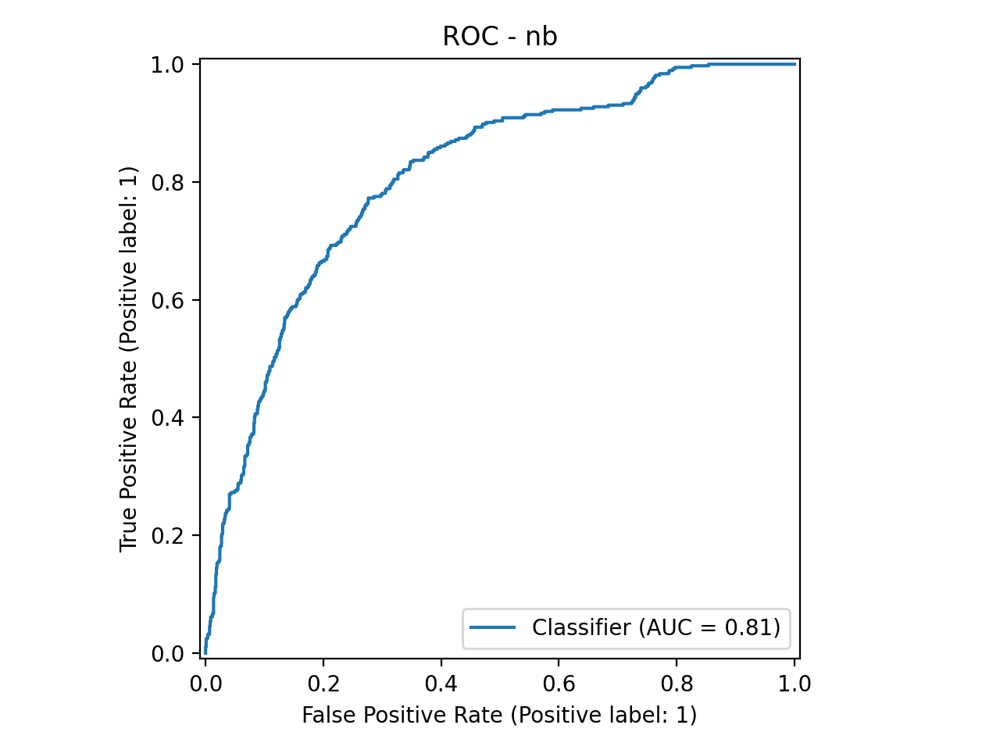  
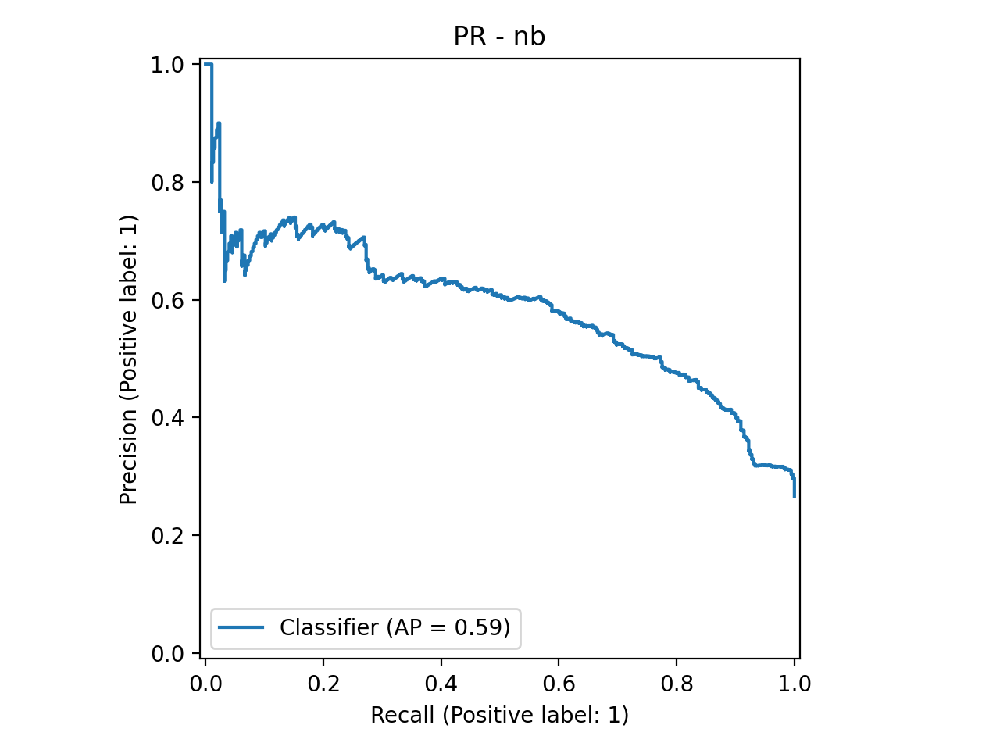

### SVM Lineal (Calibrated)
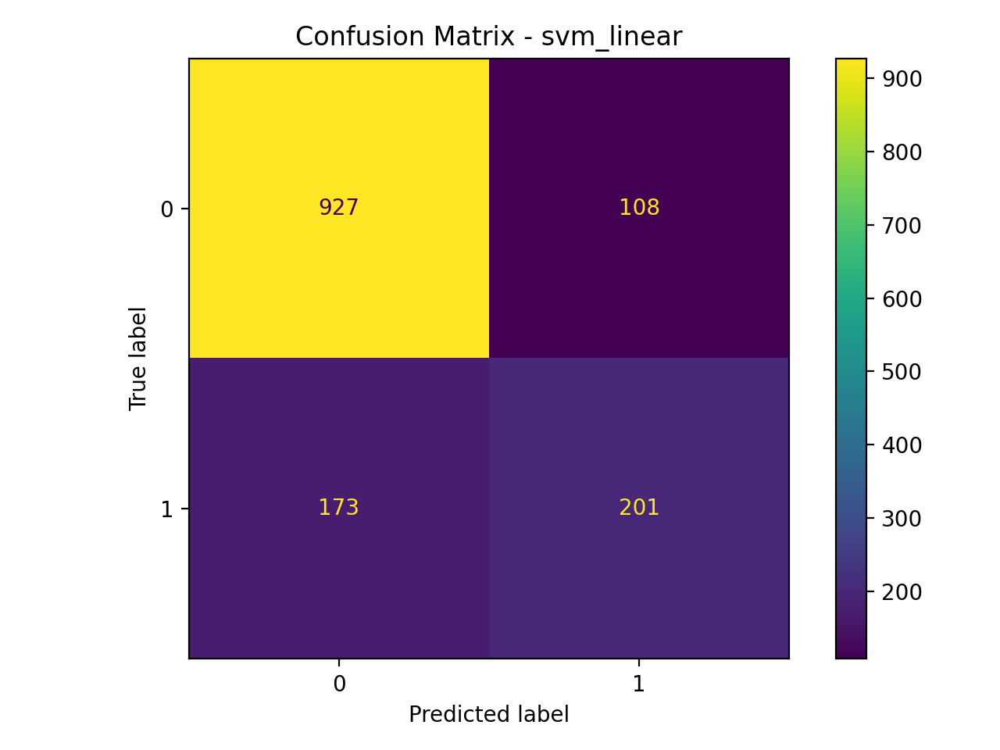  
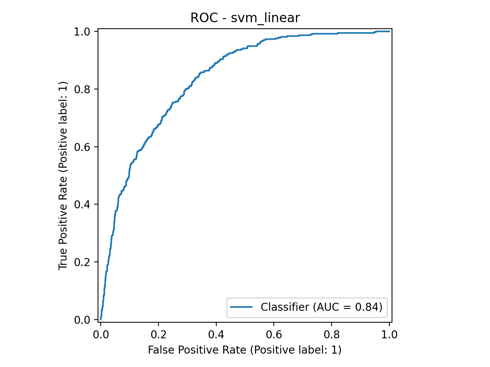  
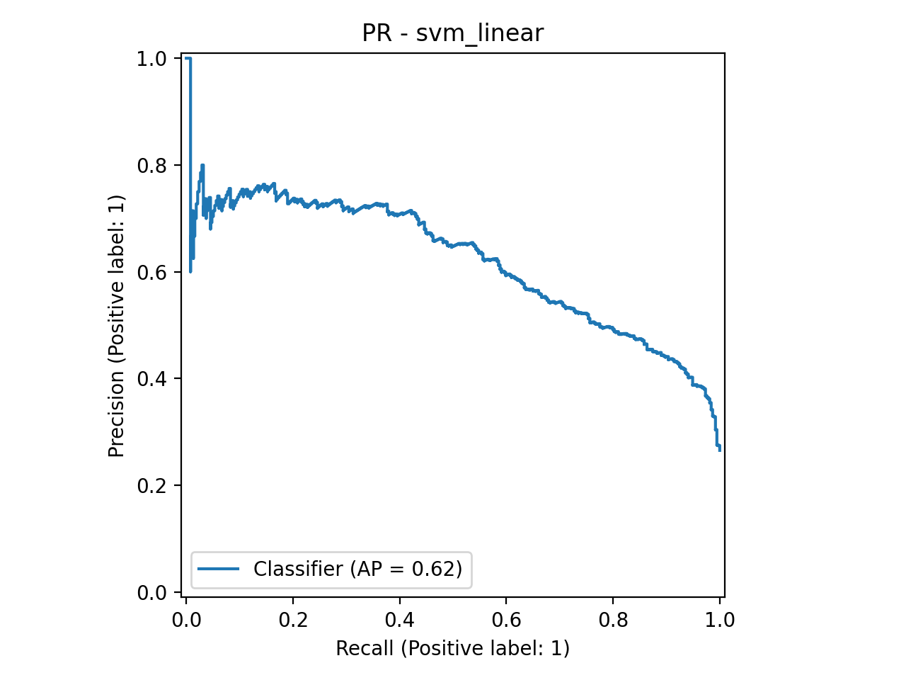

### SVM RBF
  
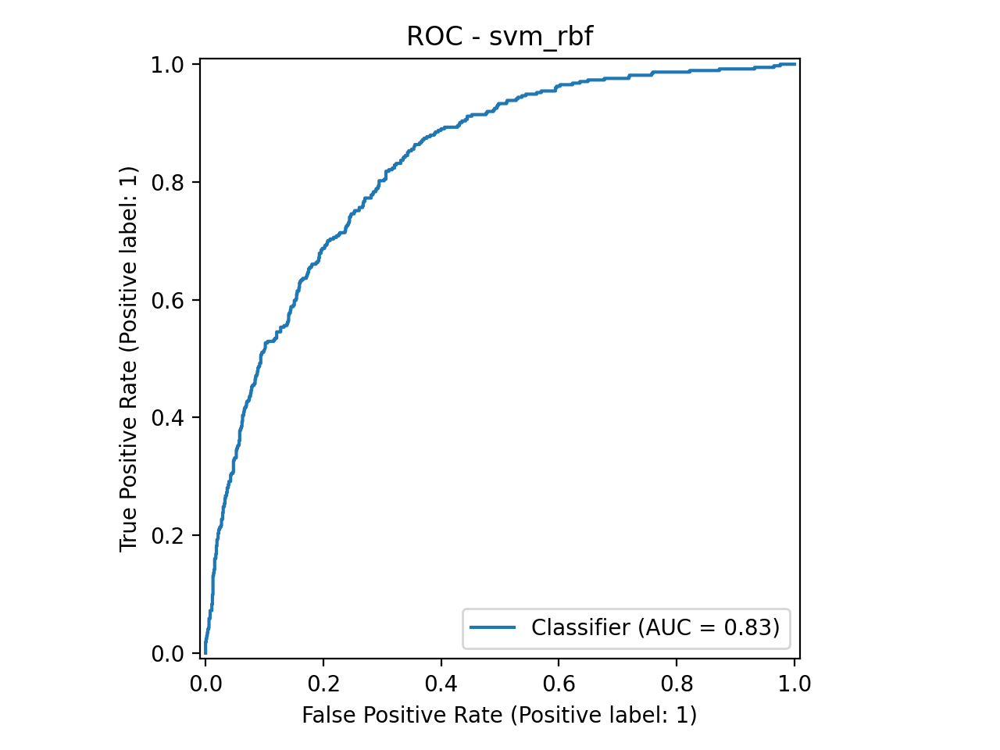  
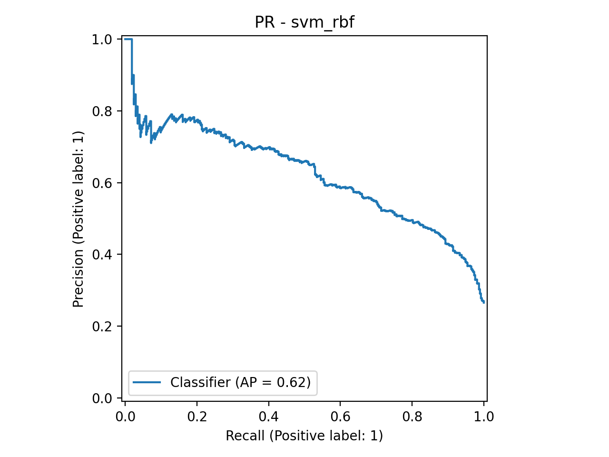

### SVM RBF Balanced
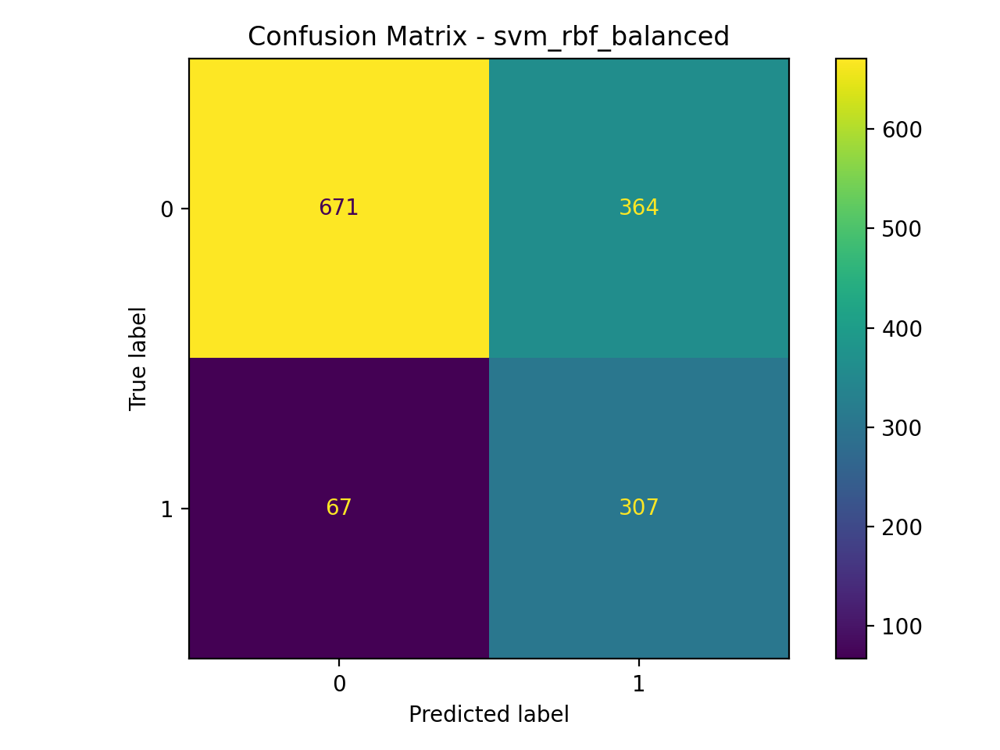  
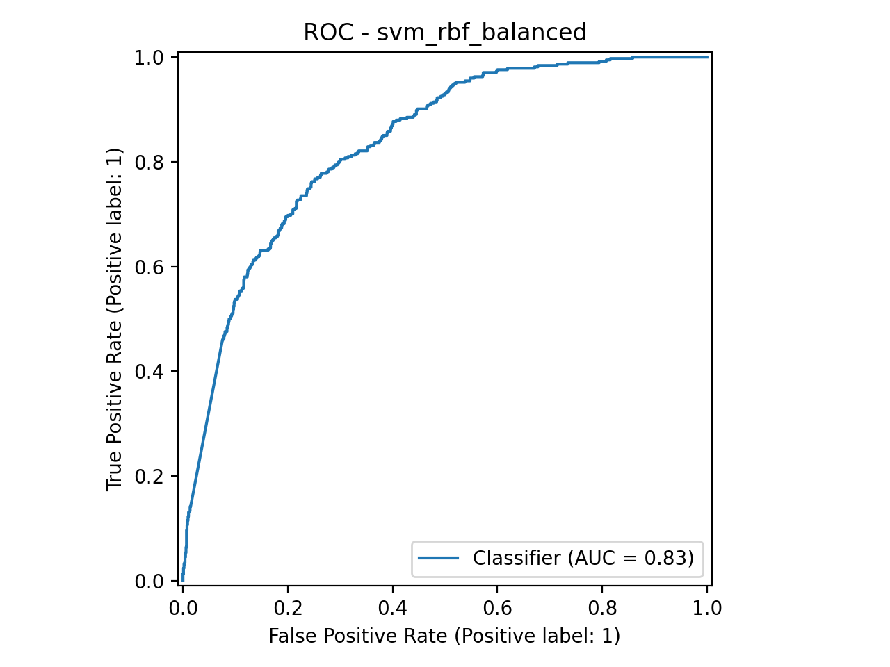  
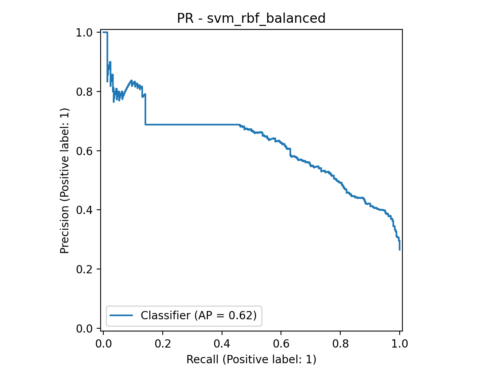

---

## 📋 Comparación de modelos (conjunto de prueba)

| Modelo              | Accuracy | Precision | Recall | F1     | ROC-AUC | PR-AUC |
|---------------------|----------|-----------|--------|--------|---------|--------|
| Naive Bayes         | 0.6948   | 0.4589    | 0.8369 | 0.5928 | 0.8074  | 0.5853 |
| SVM Linear          | 0.8006   | 0.6505    | 0.5374 | 0.5886 | 0.8357  | 0.6205 |
| SVM RBF Balanced    | 0.6941   | 0.4575    | 0.8209 | 0.5876 | 0.8342  | 0.6230 |
| SVM RBF             | 0.7963   | 0.6408    | 0.5294 | 0.5798 | 0.8298  | 0.6248 |

---

## 🧠 Conclusiones

1. El problema de churn presenta un desbalance significativo, por lo que métricas como F1-score y PR-AUC resultan más informativas que la accuracy.
2. Naive Bayes mostró un alto recall, siendo adecuado cuando se prioriza detectar la mayor cantidad posible de clientes propensos a churn.
3. SVM Linear y RBF lograron mejores compromisos entre precisión y recall, destacando en ROC-AUC.
4. La incorporación de `class_weight="balanced"` permitió aumentar el recall del modelo RBF, a costa de una disminución en precisión.
5. En contextos reales de negocio, la elección del modelo debe alinearse con el costo asociado a falsos negativos y falsos positivos.

## Consideraciones Computacionales

- Naive Bayes presentó el menor costo computacional, siendo rápido tanto en entrenamiento como en inferencia.
- SVM RBF requirió tiempos significativamente mayores durante la búsqueda de hiperparámetros.
- El uso de RandomizedSearch permitió explorar el espacio de parámetros de forma más eficiente que GridSearch.

---

## 📂 Estructura del repositorio

```text
actividad3-ml2-churn-classification/
├── notebooks/
│   └── Actividad3_ML2.ipynb
├── data/
│   └── data-churn.csv
├── figures/
│   ├── *.png
├── README.md
├── requirements.txt
└── .gitignore
```
## Reproducibilidad

Para ejecutar el proyecto localmente:

```bash
git clone https://github.com/sebamarinovic/actividad3_ML2.git
cd actividad3_ML2
pip install -r requirements.txt
jupyter notebook Actividad3_ML2.ipynb
